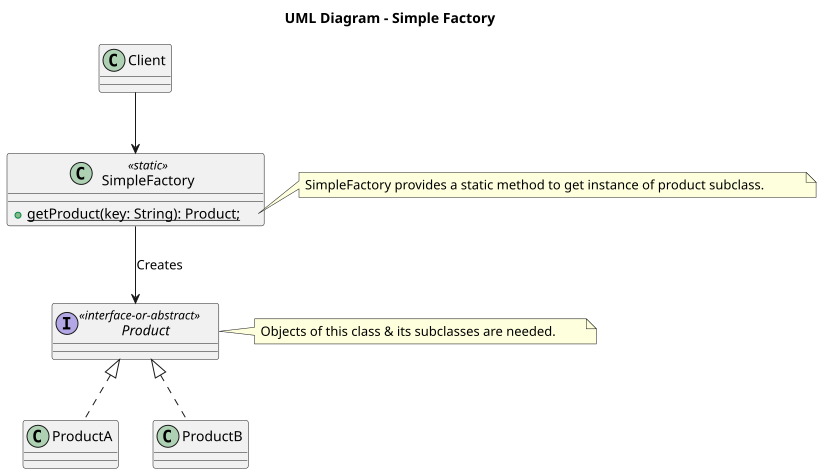

# SOLID Principles & Design Patterns using Java

- This repository contains code and implementation related to SOLID principles, and Design Patterns, all implemented using Java.
- The entire repository will be well structured, and have a table of contents to reflect each topic, and where to find related to text along with the code.

> __NOTE-1__: All UML diagrams are generated using [`PlantUML`](https://plantuml.com) specification, and are generated using [`PlantText`](https://planttext.com) application. 

## Table of Contents

1. [SOLID Principles](#solid-principles)
   1. [Single Responsibility Principle (SRP)](#single-responsibility-principle-srp)
      - [Code &mdash; SRP Violation](./src/main/java/com/ram/java/solid/singleresponsibilityprinciple/UserController.java#L30-L120)
      - [Code &mdash; SRP Violation: Resolved](./src/main/java/com/ram/java/solid/singleresponsibilityprinciple/UserController.java#L1-L29)
      - [Full Code](./src/main/java/com/ram/java/solid/singleresponsibilityprinciple)
   2. [Open Closed Principle (OCP)](#open-closed-principle-ocp)
      - [Code &mdash; OCP Violation](./src/main/java/com/ram/java/solid/openclosedprinciple/violation/)
      - [Code &mdash; OCP Violation: Resolved](./src/main/java/com/ram/java/solid/openclosedprinciple/resolved/)
   3. [Liskov Substitution Principle (LSP)](#liskov-substitution-principle-lsp)
      - [Code &mdash; LSP Violation](./src/main/java/com/ram/java/solid/liskovsubstitutionprinciple/violation/)
      - [Code &mdash; LSP Violation: Resolved](./src/main/java/com/ram/java/solid/liskovsubstitutionprinciple/resolved/)
   4. [Interface Segregation Principle (ISP)](#interface-segregation-principle-isp)
      - [Code &mdash; ISP Violation](./src/main/java/com/ram/java/solid/interfacesegregation/services/violation/)
      - [Code &mdash; ISP Violation: 1st Resolution](./src/main/java/com/ram/java/solid/interfacesegregation/services/resolved_1/)
      - [Code &mdash; ISP Violation: 2nd Resolution](./src/main/java/com/ram/java/solid/interfacesegregation/services/resolved_2/)
   5. [Dependency Injection Principle (DI)](#dependency-inversion-principle-di)
      - [Code &mdash; DI Violation](./src/main/java/com/ram/java/solid/dependencyinversion/services/violation/)
      - [Code &mdash; DI Violation: Resolved](./src/main/java/com/ram/java/solid/dependencyinversion/services/resolved/)

2. [Design Patterns](#design-patterns)
   1. [Creational Design Patterns](#creational-design-patterns)
      1. [Builder Pattern](#builder-design-pattern):
         - [UML Diagram  &mdash; `UserDTOBuilder`](./resources/images/builder-pattern-example-userdto.svg) | [Code to generate UML diagram](./resources/uml/builder-pattern-example-userdto.puml)
         - [Traditional Code &mdash; `UserDTOBuilder`](./src/main/java/com/ram/java/designpatterns/builder/traditional/)
         - [Modern Real World Code &mdash; `UserDTOBuilder`](./src/main/java/com/ram/java/designpatterns/builder/modernrealworld/)
      2. [Simple Factory Pattern](#simple-factory-pattern):
         - [UML Diagram &mdash; `SimpleFactory`](./resources/images/simple-factory-uml.svg) | [Code to generate UML diagram](./resources/uml/simple-factory-uml.puml)
         - [Code &mdash; `SimpleFactory` Implementation]()

## SOLID Principles

- SOLID is an acronym for the following principles underlying:
  1. _**S**ingle Responsibility Principle (SRP)_
  2. _**O**pen Closed Principle (OCP)_
  3. _**L**iskov Substitution Principle (LSP)_
  4. _**I**nterface Segregation Principle (ISP)_
  5. _**D**ependency Inversion Principle (DI)_

[ꜛ️](#table-of-contents)

### Single Responsibility Principle (SRP)

- SRP states that: __there should never be more than one reason for a class to change__.
- The class should provide a focussed, single functionality, and address a specific concern.
- If you've a class called `AwesomeClass`, that is responsible for communicating with the server.
  In that case, the class should never change, if any of the following changes:
  1. Communication Protocol: Code changes shouldn't occur if the underlying communication protocol changes from `HTTP` to `HTTPS`.
  2. Message Format: Code changes shouldn't occur if the underlying message format changes, like `JSON` -> `gRPC`, or `JSON` -> `XML`, or `XML` -> `GraphQL`.
  3. Communication Security: Code shouldn't be changed if a new Authentication methodology is addedas a measure of security.
- If you see now, SRP says that there might multiple reasons why our class'/API's code needs to be changed, and this is what is to be avoided following SRP.
- As aformentioned in the example, if there are 3 separate responsibilities, then there should be 3 separate classes/modules to handle those responsibilities.
  - This way, whenever something changes, our code can be changed in an organised manner, ensuring that the core class/module isn't changed, and the changes are minimal in nature.

SRP: **THERE SHOULD NEVER BE MORE THAN ONE REASON FOR A CLASS TO CHANGE**.

[ꜛ️](#table-of-contents)

### Open Closed Principle (OCP)

- OCP states that: __Software entities (classes, modules, methods, etc) should be Open for extension, but Closed for modification__.
- **Open for Extension** &mdash; `extend` existing behaviour (IS-A relationship establishment in OOP).
- **Closed for Modification** &mdash; Existing code remains unchanged.
- Example:
  - _Base_ class is `extend`ed by a _Derived_ class, where the _Base_ class should not be changed again, since it's already well tested.
  - But since it's a _Base_ class, it's Open for extension via the _Derived_ class.
  - Therefore:
    1. Open for Extension => can derive from base, and override methods.
    2. Closed for Modification => avoid modifying base class.
    
 OCP: **SOFTWARE ENTITIES (CLASSES, MODULES, METHODS, etc) SHOULD BE OPEN FOR EXTENSION, BUT CLOSED FOR MODIFICATION**

[ꜛ️](#table-of-contents)

### Liskov Substitution Principle (LSP)

- LSP states that: __We should be able to substitute *Base* class objects with *Child* class objects & this should not alter the desired behaviour/characteristics of the program__.
- Here, we're not simply talking about type level replacement of *Base* class object with *Child* class object.
  We're also talking about the behaviour being unaffected for the overall program if there's a change from *Base* class' object, to *Child* class' object.

LSP: **WE SHOULD BE ABLE TO SUBSTITUTE BASE CLASS OBJECTS WITH CHILD CLASS OBJECTS, AND THIS SUBSTITUTION SHOULD NOT ALTER THE DESIRED BEHAVIOUR/CHARACTERISTIC OF THE PROGRAM**

[ꜛ️](#table-of-contents)

### Interface Segregation Principle (ISP)

- ISP states that: __Clients should not be forced to depend upon interfaces that they do NOT use__.
- In particular, we're talking about methods. Clients shouldn't have to depend on methods that are defined in interfaces that they don't use.
- More in particular, we're talking about a term known as Interface Pollution.
  - __Interface Pollution__:
    1. Unnecessarily Large Interfaces.
    2. Crammed-in, Unrelated Methods into the Interface.
  - __Signs of Interface Pollution__:
    1. Classes have empty method implementations.
    2. Method implementations throw UnsupportedOperationException (or similar).
    3. Method implementations return null or default/dummy values.
- In essense, ISP is asking to __Write Highly Cohesive Interfaces__, meaning, break down larger interfaces, so that methods or behaviours/contracts that are defined in an interface,
  are cohesive, and are related to each other, and we don't run into a situation where a class is forced to provide an implementation for a method, for which it doesn't make any sense.

ISP: **CLIENTS SHOULD NOT BE FORCED TO DEPEND UPON INTERFACES THAT THEY DO NOT USE**

[ꜛ️](#table-of-contents)

### Dependency Inversion Principle (DI)

- DI states the following:
  1. __High level modules should not depend upon low level modules__ &mdash; __both should depend upon abstractions__.
  2. __Abstractions should not depend upon details__ &mdash; __details should depend upon abstractions__.
- What exactly is a _Dependency_?
  - E.g. 1: Let's say we've our own method called `printMe`:

    ```java
    public void printMe() {
		System.out.println("Hello!");
		//     ^^^	<------------------------------------------ Dependency (makes use of `out` object from inside System class)
	}
    ```

    > `out` object is the _dependency_ in this situation, for the code inside `printMe` method.

  - E.g. 2: Let's say we're writing a method that will generate a report in JSON format, and the method will write that JSON formatted report on the disk:
  
    ```java
    public void writeReport() {
		Report report = new Report(); 	// This is NOT a Dependency because this method is supposed to write a Report.

		// Build the report
		JSONFormatter formatter = new JSONFormatter();
		//            ^^^^^^^^^ <------------------------------ Dependency (being created inside `writeReport` method)

		String report = formatter.format(report);
		FileWriter writer = new FileWriter("report.json");
		//		   ^^^^^^ <------------------------------------ Dependency (being created inside `writeReport` method)

		// Write out the report
		writer.write();
		writer.close();
	}
    ```

    > `writeReport` is dependent on `formatter` and `writer`, therefore, both `formatter` and `writer` are dependencies in `writeReport` method.

- Dependency Inversion is asking the programmer to not create dependencies inside the `writeReport` method, but those dependencies must be provided to `writeReport` method.
  - Because both `formatter` and `writer` objects are created inside the `writeReport` method, 
    the `writeReport`'s implementation is now tightly coupled to the implementation of `JSONFormatter`'s object,
    and `Writer` object, specifically `FileWriter` object.
  - __WRENCH IN THE WORKS__: If there's a new requirement that asks for the following changes?
    1. Write the report in HTML format.
    2. Write the report to memory/network, instead of disk.
    > Just these bunch of changes would invoke a change in the existing `writeReport` method, which is something we, as developers should avoid.
    > The more code changes we do, the more there's a good chance of breaking existing behaviour of already tested code, and more inclusion of bugs.
  - DI basically is asking for the High level module(s) (the module that defines the business rules, like `writeReport` method)
    NOT to depend on Low level module(s) (the modules that are basic functionalities and can be used anywhere, a good example is `JSONFormatter`).
  - Both High level module(s) and Low level module(s) should NOT be tightly coupled, and ideally, both should depend on Abstractions.
    - Instead of creating `JSONFormatter` and `FileWriter` objects inside `writeReport` method, why not let the caller of the method provide those
      dependencies for you, so that you don't have the responsibilit of creating such objects at your end.
    - Also, this way, `writeReport` only knows that it's dealing with some instance of `Formatter` and `Writer` (as interfaces, and not actual instances).

    ```java
    public void writeReport(Formatter formatter, Writer writer) {		// Both Formatter & Writer are interface references provided to `writeReport` method.
		Report report = new Report();

		// Build the report
		String report = formatter.format(report);						// We're NOT creating the dependency here anymore.
		
		// Write out the report
		writer.write(report);											// We're NOT creating the dependency here as well.
	}
    ```
    
    > Anyone who now wants to fulfil the previous requirements like:
    > 1. Write the report in HTML format: The caller can simply pass in a different implementation of the `Formatter`, and this should work as expected.
    > 2. Write the report to memory/network, instead of disk: The caller can simply pass in a different implementation of the `Writer`, and that should take care of the report being written to memory/network.

- Best example of Dependency Inversion can be seen inside Spring & Spring Boot, which uses DI for almost everything &mdash;
  `@Autowire`, `@Bean`, etc., are all injected via Spring Dependency Injection via Dependency Inversion Principle.

DI:

1. __HIGH LEVEL MODULES SHOULD NOT DEPEND UPON LOW LEVEL MODULES__ &mdash; __BOTH SHOULD DEPEND UPON ABSTRACTIONS__.
2. __ABSTRACTIONS SHOULD NOT DEPEND UPON DETAILS__ &mdash; __DETAILS SHOULD DEPEND UPON ABSTRACTIONS__.

[ꜛ️](#table-of-contents)

---

## Design Patterns

- There are 26 design patterns, and remembering every design pattern is almost impossible.
- That's why, all these 26 design patterns are divided into 3 categories:
  1. CREATIONAL: patterns that deal with the process of creation of objects of classes.
  2. STRUCTURAL: patterns that deal with how classes and objects are arranged or composed.
     These design patterns deal with how we can arrange our classes and objects so that we can derive a functionality out of them.
  3. BEHAVIORAL: patterns that deal with how classes and objects interact & communicate with each other.
     Mainly, these patterns are responsible for how we can design the interaction/communication between classes and objects,
     so that we can achieve the desired goal with these objects.

[ꜛ️](#table-of-contents)

### Creational Design Patterns

- Creational design patterns deal with the process of creation of objects of classes.
- Why do we need a category of design patterns to create the object of a class when we already have the `new` operator?
  - Answer: __It's not that simple__!
  - In real life software development, a single object may need multiple other objects before it can even be instantiated.
  - Sometimes there might be a requirement that there should only be a single object of your class in the entire application.
    That class might just be representing something like a Configuration, and therefore, you want only 1 object of that class,
    from which the entire application can read the configuration, from a single source of truth, which is a single object.
- The following are some of the Creational Design Patterns:
  1. Builder
  2. Simple Factory
  3. Factory Method
  4. Prototype
  5. Singleton
  6. Abstract Factory
  7. Object Pool

[ꜛ️](#table-of-contents)

#### Builder Design Pattern

<details><summary><em>Why use Builder pattern?</em></summary>

- Let's say, you want a `Product` class that needs to have its object, to be immutable => once `Product`'s object is created, none of its internal values should ever change.
- Therefore, for an object (like `Product`) that needs to be immutable (whose state cannot change once created), we've an example of that in Java, which is `String` class object.
- But when you, as a programmer, is writing a class whose instance needs to be immutable, you might have a scenario where the class' constructor can have many parameters,
  and therefore, it can become really difficult to keep track of which argument is to be sent where, whenever the object is to be created for that class.
  - Example-1: let's take a real-world example of `Product` class:

    ```java
    class Product {
		public Product(int weight, double price, int shipVolume, int shipCode) {
			// Code to initialize the class members
		}
		
		// Other code for methods and behaviour
	  }
    ```

	  > IMPORTANT NOTE
	  > --------------
    > In this class, as can be seen, there are different data typed variables like <int, double, int, int>, that can be confused when passing via `new` keyword to create a `Product`
    > class' instance, and there can be an argument made where the variable name themselves can be considered a self-documentation of what values to be passed where.
    > But that assumption quickly fails &mdash; the code when shared to another vendor, or imported as a library, is usually shared as a JAR/WAR file, which goes through the phases
    > of compilation, where variable names are usually replaced with generic variable names decided by the compiler during compilation. Therefore, self-documenting variable naming
    > also doesn't help in this case.
 
	  - Therefore, Builder design pattern helps us mitigate this in 2 ways:
	    1. Builder makes it easy to make use of such (relatively large) constructors, so that we can create immutable objects of such a class.
	    2. Builder pattern also helps us avoid writing a constructor so large, and force us to think about writing constructors which are smaller in nature, and easier to deal with as well.
	
	- Example-2: Objects that need other objects, or "parts" of other objects to construct them, would be a good place, to make use of Builder pattern, to replace such instances for
	  maintaining clean code. If you've an `Address` object, which is used as a part of `User` object, then, you need to be able to build the `Address` object first, and then build the
	  `User` object post that.

	  ```java
	  class Address {
		public Address(String houseNumber, String street, ...) {
			// Initialisation code for Address object...
		}
		
		// Other code
	  }
	  ```

	  ```java
	  class User {
		public User(String name, Address address, LocalDate birthdate, List<Role> roles) {
			//														   ^^^^^^^^^^  <----------- List of Role objects also have to be maintained immutably.
			//                   ^^^^^^^  <---------------------------------------------------- Address object being used here.
			// Initialising code for User object...
		}
		
		// Other code
	  }
	  ```
	  
	  > In such a situation, the Builder design pattern makes a lot of sense.
</details>

<details><summary><em>What is a Builder?</em></summary>

- Whenever we've a complex process to construct an object involving multiple steps, thinking of clean coding using _Builder_ design pattern, can help us.
- In _Builder_, we abstract away (or more precisely, obscure away) the burden of creation from the caller (client) code, to a separate class, which when used
  by the user of the object, makes it really easy to create the object, in an immutable way, makes a lot of sense to the user (the code to generate the
  following UML diagram can be found inside [/resources/uml/builder-design-pattern-product-example.puml](./resources/uml/builder-design-pattern-product-example.puml))

  
  

  > Usually, there's an abstract `Builder` class, which is implemented by a `ConcreteBuilder` class, which loosely associates and is composed of the actual
  > immutable instance the user wants to create, in this instance, it's `Product` class' instance.
  >
  > The `Director` class loosely composes of `Builder` class' instance (meaning `Builder` is created inside `Director`), and from the `Builder` instance,
  > we get the the required class' immutable instance &mdash; `Product` instance. Therefore, `Director` class is like a driver program which drives the
  > building of the instance in question.
</details>

<details><summary><em>How to implement a Builder?</em></summary>

- We start by creating a `Builder` class:
  - Identify the "__parts__" of the class you want to build builder for (in this case `Product`), and provide methods to create methods for those "__parts__".
  - Provide a method to "__assemble__" of build the final object (in this case `Product` object is to be provided).
  - The builder must provide a way/method to get the fully built object out. _Optionally_, the builder can keep the instance of the object that was built
    (`Product` in this case), so the same reference can be returned again in future.
- A `Director` can be a separate class, OR, the client (wherever the `Builder` instance is created) themselves can play the role of director.
  - __NOTE__: Flow, and logic related to `Builder` class' instance creation is almost always taken care by a client/caller class, creating a separate
  `Director` class is really rare nowadays.
</details>

<details><summary><em>Implementation Details</em></summary>

1. Implementing builder pattern as a inner static class, creates an immutable class iff members & setters are private.
   - Even if immutability is not the concern, finding this kind of implementation of builder, where the builder class is an inner static class, is very common.

</details>

<details><summary><em>Design Considerations</em></summary>

1. The director role is rarely implemented as a separate class, typically the consumer of the object (viz. client) handles that role.
1. Abstract builder (like in [`UserDTOBuilder`](./src/main/java/com/ram/java/designpatterns/builder/traditional/UserDTOBuilder.java)) is not required if the
   class itself is NOT a part of any inheritance hierarchy, meaning, if you've `UserDTO` being implemented by `UserRestDTO` and `UserWebDTO`, then in that
   case, you'd need a `UserDTOBuilder` abstract builder, and that can be implemented by `UserRestDTOBuilder` and `UserWebDTOBuilder`s respectively.
   - In most of the cases, you can write a concrete builder without any abstract builder.
1. If you're running into "__too many constructor arguments__" problem, then it's a good indication that builder pattern may help (this is just an indication,
   and NOT actually probably the actual solution for the problem, depending on the problem itself).

</details>

<details><summary><em>Real World Builder Examples</em></summary>

| Example | Is good builder pattern example? | Why/not? | Should use example in interview? |
| ------- | -------------------------------- | -------- | -------------------------------- |
| `java.lang.StringBuilder` | PARTIALLY | Allows the user to build the final object in parts, but the code actually doesn't follow the builder pattern as described by GoF. | NO |
| `java.util.Calendar.Builder` | YES | This is a properly implemented builder pattern code for getting the `Calendar` object. The code follows GoF | YES |

> * GoF: [Gang of Four](https://en.wikipedia.org/wiki/Design_Patterns#:~:text=to%20as%20the-,Gang%20of%20Four%20(GoF).,-%5B2%5D), are __4 famous authors__ who wrote the book
>        and introduced clean code using design patterns to the world. The name of the book is [Design Patterns: Elements of Reusable Object-Oriented Software](https://www.amazon.in/Design-Patterns-Object-Oriented-Addison-Wesley-Professional-ebook/dp/B000SEIBB8),
>        written by __Erich Gamma__, __Richard Helm__, __Ralph Johnson__, and __John Vlissides__.

</details>

<details><summary><em>Pitfalls of Builder Pattern</em></summary>

1. More Boilerplate Code:

	 Instead of simply:

   ```java
   User user = new User("Ram", "ram@example.com");
   ```

   you may end up with:

	 ```java
	 User user = new User.Builder()
	 			         .name("Ram")
	 			         .email("ram@example.com")
	 			         .age(31)
	 			         .build();
	 ```

   - You typically need:

     1. A `Builder` class.
     1. Builder fields.
     1. Builder methods.
     1. A `build()` method.
     1. Constructor logic to transfer builder state.

     For smaller classes, this can be unnecessary complexity.

2. Duplication of Fields: The builder often has the same fields as the original class, and therefore, changes to the actual class' fields, may require changes in 2 places instead of 1 before using a `Builder` pattern.

   ```java
   class User {
       private String name;
       private String email;
       private int age;

       // Private Setters to be used by `Builder` inner static class

       public static class Builder {
           private String name;
           private String email;
           private int age;
       }

       // Builder methods for setting the `User` objects fields
   }
   ```

3. Validation Can Become Complicated

   Assume the following code:

   ```java
   User user = new User.Builder()
	 			       .email(null)
	 			       .age(-10)
	 			       .build();
   ```

   > Where should validation happen?
   >
   > 1. You could validate in each setter:
   >
   >    ```java
   >    public Builder age(int age) {
   >		if (age < 0) {
   >			throw new IllegalArgumentException();
   >        }
   >
   >        this.age = age;
   >        return this;
   >    }
   >    ```
   >
   > 2. But if there are multiple fields to be validated, then what?
   >
   >    ```java
   >    startDate < endDate
   >    ```
   >
   >    That usually belongs in `build()`.

   _As a resilt, validation can become spread across the builder and constructed object_.

4. Mutable Builder State

   - A builder is generally mutable (consider the code below):

     ```java
     User.Builder builder = new User.Builder();
     builder.name("Ram");                       // Using User.Builder's instance to set "Ram" as name for User object.
     User user1 = builder.build();              // User object with name as "Ram".

     builder.name("Sai");						// Using the previous User.Builder's instance to set the name to "Sai".
     User user2 = builder.build();              // User object with name as "Sai" now.
     ```

     > This means that you need to understand whether reusing a builder is sage and what state it currently contains.
     > This becomes particularly problematic if builders are shared across threads.

5. Builder doesn't automatically guarantee immutability.

   - A common misconception is: "If I use Builder, my object is immutable"
   - An example of how Builder can make mutable objects:

     ```java
     class User {
         private final List<String> roles;

         private User(Builder builder) {
             this.roles = builder.roles;
         }
     }
     ```

     The `User` field is `final`, but the underlying list can still be modified through the builder/reference.

     You may need to resolve this by making use of `List.copyOf(builder.roles)` to ensure immutability:

     ```java
     this.roles = List.copyOf(builder.roles);
     ```

     __So, Immutability has to be deliberately implemented, instead of assuming it to be the case with Builder pattern__.

6. Can Hide Expensive Construction

   The following code:

   ```java
   User user = new User.Builder()
                       .name("Ram")
                       .email("ram@example.com")
                       .age(31)
                       .build();
   ```

   looks simple, but `build()` might be doing significant work:

   1. Validation
   1. Defensive Copying
   1. Created Nested Objects
   1. Parsing Values
   1. Loading Resources
   1. Applying Defaults

   The fluent syntax can make construction appear cheaper/simpler that it actually is, thereby hiding the internal complications and cost.

7. Too Many Builders Can Clutter the API

   If every class has a builder:

   ```
   User
   User.Builder

   Address
   Address.Builder

   Order
   Order.Builder

   Product
   Product.Builder
   ```

   the codebase can become builder-heavy.

   __This is especially noticeable in projects where builders are often generated by Lombok or IDEs__.

8. Telescoping Constructors May Sometimes Be Better

   > Builder isn't automatically superior

   For a class with only a couple of parameters:

   ```java
   new Point(10, 20);
   ```

   is arguably better than:

   ```java
   new Pointer.Builder()
              .x(10)
              .y(20)
              .build();
   ```

   The _Builder_ pattern becomes more compelling as construction becomes more complex of has any optional parameters.

9. Builder Can Become a "God Builder"

   A poorly designed builder can accumulate lots of logic:

   ```java
   new User.Builder()
       .name(...)
       .email(...)
       .validateEmail(...)
       .loadPermissions(...)
       .calculateDefaults(...)
       .createAddress(...)
       .sendNotification(...)
       .build();
   ```

   At that point, the builder is doing far more than __constructing the object__.

   The pattern itself isn't the problem &mdash; the builder has simply accumulated responsibilities that belong elsewhere.
   - This one can be termed as a programmer's mistake being inexperienced.

10. Required Parameters Can Be Forgotten

    With a conventional builder:

    ```java
    User user = new User.Builder()
                        .email("ram@example.com")
                        .build();
    ```

    What if `name` is mandatory?

    You only find out at runtime unless `build()` validates it.

    There are more sophisticated approaches, such as a __step builder__, to enforce construction order/required fields at compile time, but the add even more complexity.

</details>

<details><summary><em>Summary</em></summary>

| Pitfall           | Consequence                           |
| ----------------- | ------------------------------------- |
| Boilerplate       | More code                             |
| Duplicate fields  | Maintenance burden                    |
| Mutable builder   | Potential state/thread-safety issues  |
| Validation        | Can become complicated                |
| Immutability      | Not guaranteed automatically          |
| Too many builders | API/codebase clutter                  |
| Simple objects    | Builder may be overengineering        |
| Required fields   | May only fail at runtime              |
| Complex `build()` | Construction logic can become bloated |

- __The Key Rule__:

  _Don't use Builder merely because a class has multiple fields_.

  > Use it when the construction process itself benefits from being explicity and readable &mdash; particularly when there are many:
  > 1. Optional Parameters,
  > 1. Combinations of Parameters,
  > 1. Defaults,
  > 1. Validation, OR,
  > 1. When you want to construct an immutable object without a huge constructor!

  For something like:

  ```java
  new User(name, email);
  ```

  a builder is unnecessary.

  For something like:

  ```java
  new User.Builder()
      .name(name)
      .email(email)
      .age(age)
      .phone(phone)
      .address(address)
      .roles(roles)
      .preferences(preferences)
      .build();
  ```

  the Builder pattern starts providing a real benefit.

</details>

[ꜛ️](#table-of-contents)

#### Simple Factory Pattern

<details><summary><em>What Problem <strong>Simple Factory</strong> Solves?</em></summary>

> Often, Simple Factory, by a lot of computer scientists and academicians, and developers, DO NOT consider Simple Factory, as a design pattern, and that will be evident why if you read more on it.

When multiple types can be instantiated, and the choice is based on some simple criteria.

Take the following code for example:

```java
if (key.equalsIgnoreCase("pudding")) {
	// Create Pudding Object
} else if (key.equalsIgnoreCase("cake")) {
	// Create Cake Object
}
```

this is the type of code where a Simple Factory is often used.

</details>

<details><summary><em>What is a <strong>Simple Factory</strong>?</em></summary>

- Here, we simple move the instantiation logic to a separate class, and most commonly, to a static method of this class.
- Some do not consider simple factory to be a "design pattern", as it's simply a method that encapsulates object instantiation. Nothing complex goes on in that method.
  - We are studing _simple factory_ as it's often confused with "Factory Method" pattern.
- Typically, we want to implement a _simple factory_ if we've more than one option when instantiating an object and a simple logic is used to choose correct class.



> Find the code for `SimpleFactory` UML at [`/resources/uml/simple-factory-uml.puml`](./resources/uml/simple-factory-uml.puml)

</details>

<details><summary><em>Steps to implement a <strong>Simple Factory</strong></em></summary>

- We start by creating a separate class for our Simple Factory:
  - Add a method which returns desired object instance.
    - This method is static (typically), and accepts some argument (of String type, or the parent reference type) to decide which class to instantiate and return to the Client/caller.
    - You can also provide additional arguments which will be used to instantiate objects.

</details>

<details><summary><em>Implementation Considerations</em></summary>

- Simple factory can be just a method in existing class. Adding a separate class however allows other parts of your code to use simple factory, more easily.
- Simple factory itself doesn't need any state tracking any object/variable's value(s), so it's best to keep this as a `static` method.

</details>

<details><summary><em>Design Considerations</em></summary>

- Simple factory will in turn may use other design patterns like _Builder_ to construct objects.
- In case you want to specialise your simple factory in sub-classes, you need __Factory Method__ design pattern instead.

</details>

<details><summary><em>Real World Examples of Simple Factory</em></summary>

- The [`java.text.NumberFormat`](https://apidia.net/java/OpenJDK/26/?pck=java.text&cls=.NumberFormat) class has [`getInstance()` method](https://github.com/openjdk/jdk26u/blob/baf63fbe42b8758448fee570a9d9bb914272d259/src/java.base/share/classes/java/text/NumberFormat.java#L1122-L1148), which is an example of simple factory.
- In case you want to specialise your simple factory in sub-classes, you need __Factory Method__ design pattern instead.

</details>

<details><summary><em>Simple Factory vs. Factory Method</em></summary>

| Simple Factory | Factory Method |
| -------------- | -------------- |
| - We simply move out instantiation logic away from client code. Typically into a `static` method. | - Factory method is more useful when you want to delegate object creation to subclasses. |
| - Simple Factory knows about all classes whose objects it can create. | - In Factory Method, we don't know in advance about all product subclasses. | 

</details>

<details><summary><em>Pitfalls of Simple Factory Pattern</em></summary>

| Pitfall                     | Consequence                                  | Reason | Example |
| --------------------------- | -------------------------------------------- | ------ | ------- |
| Violates OCP                | Factory must change for new products         | The simple factory is closed for modification only in theory. To add a new `Triangle` that implements `Shape`, the `ShapeFactory` must modify `ShapeFactory` as shown in the Example section | <pre><p>code><br/>else if(type.equals("triangle")) {<br/>&nbsp;&nbsp;return new Triangle();<br/>}</code></p></pre> |
| Concrete-class dependencies | Factory is tightly coupled                   | Tight coupling to concrete classes => that `ShapeFactory` is coupled to all concrete implementations of `Circle`, `Rectangle, `Triangle`, etc. The __client is nicely decoupled, the factory itself isn't__.  | <pre><p><code><br/>// Client.java: no coupling here<br/>Shape shape = ShapeFactory.create("circle");<br/><br/>//&nbsp;ShapeFactory.java: there's tight coupling<br/>new Circle();<br/>new Rectangle();<br/>new Square();new Triangle();</code></p></pre> |
| Growing conditional logic   | Factory becomes harder to maintain           | This inherently isn't bad for a small, stable set of products. The problem is when this becomes the primary mechanism for managing a large and frequently changing product family. | New product => another `else-if` => large `else-if` ladder, or `switch-case` becoming too large. |
| God-class tendency          | Too much creation knowledge in one place     | `ShapeFactory` can control creation of `Circle`, `Rectangle`, `Square`, `Triangle`, `Polygon`, etc. The factory starts accumulating knowledge about __every concrete product__. | _self-explanatory_ |
| Central modification point  | Teams/features can interfere with each other | Imagine different teams owning different products. With a centralised factory, the `ShapeFactory` has to be potentially modified everywhere. This creates a bottleneck, and __increases the chance of merge conflicts__. | _self-explanatory_ |
| String-based selection      | Runtime errors / typos                       | String errors are very common, where a misspelled string can get runtime errors. | <pre><p><code><br/>// Instead of the following<br/>Shape shape = ShapeFactory.create("circle");<br/><br/>// User may give a wrong string parameter as follows:<br/>ShapeFactory.create("circl");<br/>ShapeFactory.create("circel");<br/>ShapeFactory.create("Circle");</code></p></pre> |
| Complex construction        | Factory accumulates creation logic           | Initially, the logic for creation might just be easier, but as time goes, the creation of any new object, becomes more and more complicated. The factory starts becoming responsible not only for __which object to create__, but also for increasingly complicated __how to create it__. | <pre><p><code><br/>// ShapeFactory.java: Initially<br/>return new Circle();<br/><br/>// A little later:<br/>if (type.equals("circle")) {<br/>&nbsp;&nbsp;return new Circle(radius, color, renderer, configuration);<br/>}<br/><br/>// And then:<br/>else if(type.equals("rectangle")) {<br/>&nbsp;&nbsp;return new Rectangle(width, height, color, renderer, configuration);<br/>}></code></p></pre> |
| Testing Complexities        | New products implies adding new tests        | Adding a `Triangle` shape just isn't adding a new class, it's also having to modify the factory, test the new branch, potentially modify existing tests, and recompile/deploy the factory. | _self-explanatory_ |

The core pitfall is: __Simple Factory moves object-creation knowledge out of the client, but doesn't eliminate the need to modify that knowledge when new product types are added.__

</details>

<details><summary><em>Summary</em></summary>

- Simple Factory encapsulates away the object instantiation in a separate method.
- We can pass an argument to this method to indicate product type and/or additional arguments to help create objects.
- You can revise the design of the Simple Factory using the UML diagram at [`/resources/images/simple-factory-uml.svg`](./resources/images/simple-factory-uml.svg)

</details>

[ꜛ️](#table-of-contents)
